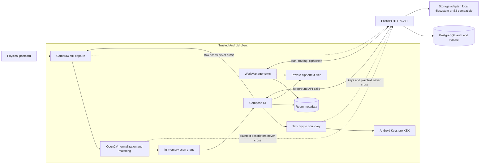
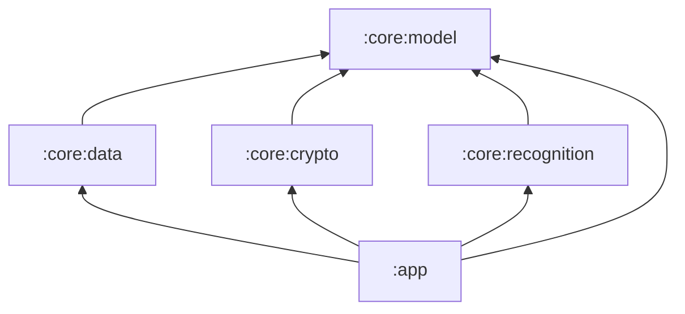
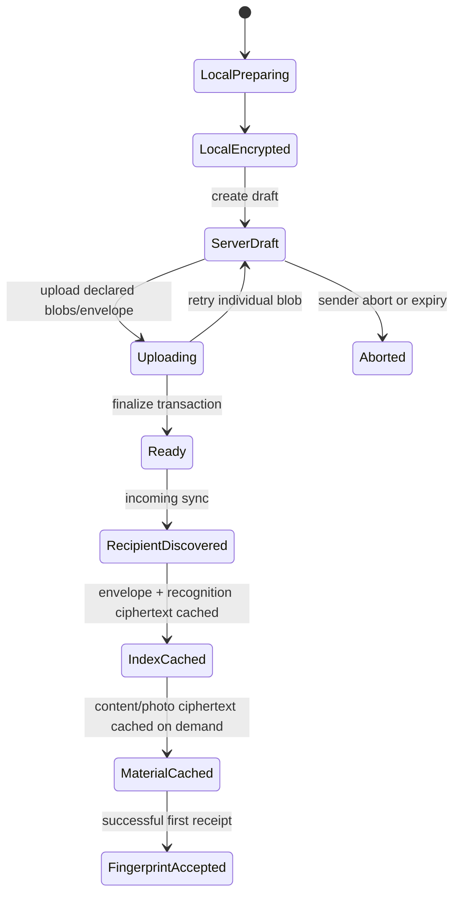

# Architecture

Status: **APPROVED for implementation.**

This document defines the system shape and lifecycle boundaries for the production-shaped MVP. Cryptographic wire details live in `security.md` and `protocol.md`; computer-vision details live in `recognition.md`.

## 1. Architectural decisions

The MVP uses the following constraints as architectural invariants:

1. The only shipping client is a native Android application.
2. Camera processing, feature extraction, matching, encryption, decryption, and signature verification happen on Android.
3. Raw postcard scans, plaintext capsule content, plaintext recognition descriptors, capsule keys, and private identity keys never leave the client.
4. The backend authenticates accounts, resolves handles, routes capsules, validates opaque upload structure, and stores ciphertext.
5. The backend cannot enforce possession of a postcard. The honest client enforces the physical-first product rule with a short-lived in-memory scan grant.
6. Incoming recognition indexes may exist locally as infrastructure, but no query or screen exposes them as an inbox or gallery.
7. A capsule is published atomically only after every declared ciphertext blob and the recipient envelope have been uploaded and verified.
8. Upload retry is blob-granular. Byte-range multipart upload is unnecessary for the deliberately size-limited MVP payload.
9. The server never records a semantic `OPENED` state. At most it knows that encrypted material was synchronized.
10. Music, contacts, iOS, web, notifications, AR, realtime frame analysis, and public/social surfaces are outside the core design.

## 2. System context and trust boundaries



### Trusted client boundary

The Android application is trusted to enforce the intended UX and protect keys against ordinary device-storage extraction. A rooted device, a maliciously modified client, screen capture, or a person with an unlocked phone can bypass the product-level scan rule. That limitation is explicit: the postcard is not a cryptographic secret.

### Backend boundary

The API, PostgreSQL, object storage, logs, backups, and operators are outside the content-confidentiality boundary. Their compromise must not reveal photos, note text, optional place labels, recognition descriptors, or capsule keys.

The server necessarily sees metadata required for accounts and routing: normalized email, normalized/current handle, immutable user IDs, public key bundles and key IDs, sender/recipient IDs, object sizes and hashes, protocol versions, timestamps, status, and traffic patterns.

## 3. Technology choices

| Area | Choice | Concrete problem solved now |
| --- | --- | --- |
| Android | Kotlin, Gradle, Jetpack Compose | Native camera/security integration and a reproducible CLI build. |
| Capture | CameraX still capture | Two deliberate captures; no realtime frame pipeline is required. |
| Recognition | OpenCV Android | On-device rectangle normalization, ORB features, matching, homography, and RANSAC. |
| Local data | Room plus app-private files | Transactional metadata plus efficient ciphertext/descriptor file storage. |
| Background work | WorkManager | Resume ciphertext upload and incoming index sync after process/network interruption. |
| Cryptography | Google Tink plus Android Keystore | Established HPKE, AEAD, signatures, keysets, and a device-protected wrapping key. |
| Backend | Python, FastAPI | A small typed HTTP boundary with straightforward Linux operation and tests. |
| Persistence | PostgreSQL, SQLAlchemy 2, Alembic | Atomic handle uniqueness, routing relations, sessions, migrations, and publish transactions. |
| Blob storage | `BlobStore` interface | Same server logic with local filesystem in development and S3-compatible storage later. |
| Local environment | Docker Compose | Reproducible API/PostgreSQL stack without external accounts. |

Versions are pinned by lockfiles/version catalogs during M0, not in this document.

## 4. Android project structure

The MVP uses five Gradle modules:

```text
android/
├── app/
├── core/model/
├── core/data/
├── core/crypto/
└── core/recognition/
```



### `:core:model`

Pure Kotlin definitions with no Android, network, persistence, Tink, or OpenCV types:

- typed IDs (`UserId`, `CapsuleId`, `BlobId`, `KeyBundleId`);
- normalized handle value object;
- capsule and delivery lifecycle enums;
- protocol-independent domain failures;
- encrypted-blob references and recognition result summaries.

### `:core:data`

Android library responsible for:

- Room database and migrations;
- HTTP DTO/adapters;
- app-private ciphertext file store;
- repositories;
- outgoing upload and incoming sync workers;
- cursor and retry state.

It depends only on `:core:model`. It stores envelopes and recognition payloads as opaque bytes and does not interpret crypto or OpenCV structures. Encryption is completed before an outbox job is enqueued; incoming sync downloads ciphertext without decrypting it.

### `:core:crypto`

Android library responsible for:

- Tink registration and primitive creation;
- account encryption/signing key bundle lifecycle;
- Android Keystore-backed key-encryption key (KEK);
- capsule keyset generation;
- manifest/blob encryption and decryption;
- HPKE recipient envelope creation/opening;
- signing and verification;
- protocol test vectors.

Only this module may handle plaintext private keysets or capsule key material. It depends only on `:core:model`.

### `:core:recognition`

Android library responsible for:

- capture quality evaluation;
- postcard rectangle detection and manual-corner input model;
- perspective normalization;
- ORB fingerprint extraction/serialization;
- descriptor and homography matching;
- configurable scoring and ambiguity classification.

OpenCV classes never cross its public boundary. It depends only on `:core:model`.

### `:app`

One-activity Compose application that owns navigation, CameraX integration, dependency wiring, and use-case orchestration. Feature packages remain packages rather than Gradle modules because the MVP has few screens and one client:

```text
dev.hryshyn.remanence/
├── auth/
├── home/
├── create/
├── scan/
├── capsule/
└── wiring/
```

Required top-level surfaces are onboarding/authentication, Home, Create, Scan, ambiguity choice, and fullscreen capsule presentation. There is no incoming list, sent list, history, or capsule deep link.

### Key interfaces

These are responsibility boundaries, not prescribed source signatures:

- `HandleResolver`: resolve and confirm a current handle snapshot, immutable user ID, and active key bundle.
- `CapsuleRepository`: persist opaque incoming capsule metadata and ciphertext references.
- `OutboxRepository`: persist blob-granular upload/finalize progress.
- `IdentityKeyManager`: generate, wrap, load, rotate, and later recover account identity keysets.
- `CapsuleCryptor`: create/open envelopes and encrypt/decrypt/verify capsule artifacts.
- `PostcardRecognizer`: normalize, fingerprint, rank, and classify candidates.
- `FingerprintStore`: persist encrypted sender/recipient fingerprints without exposing enumeration to UI.
- `ScanGrantManager`: issue and validate memory-only grants.

## 5. Android navigation and scan grant

`CapsuleScreen` accepts a random grant ID, not a capsule ID. `ScanGrantManager` holds `{grant_id, capsule_id, issued_at, expires_at}` only in process memory.

A grant is issued after:

1. both front and back were captured in the current scan session;
2. automatic recognition produced a unique accepted candidate, or the user selected a plausible ambiguous candidate;
3. control/index acceptance already passed during sync, and full presentation acceptance now passes: every declared content/photo ciphertext is present and hash-verified against the signed statement, the content manifest AEAD/layout is verified, and the recipient envelope opened successfully.

Recognition may create candidates from index material alone, but the grant itself never precedes the physical scan plus complete crypto verification and material availability.

The default grant lifetime is ten minutes and is configurable in one place. Leaving the capsule screen, process death, logout, or expiration consumes/invalidates it. Screen rotation does not invalidate it while the process and navigation entry survive.

This gate prevents accidental gallery-like navigation in the honest application. It is not claimed as DRM or cryptographic proof of postcard possession.

## 6. Local persistence model

Room contains infrastructure records only. No DAO may expose a query named or shaped as “all memories” to UI code.

From M2 onward every capsule/index/outbox/blob/cursor record and app-private
file root is scoped to the authenticated local account ID. A worker carries
only an opaque resource ID plus expected account ID and revalidates that scope
before every durable transition. Logout/account switch cancels scoped work and
scan grants. Retained ciphertext may remain for the same account, but another
account has no DAO, candidate-index, worker, or presentation path to it.

### Tables

`local_account`

- `user_id` (single active account scope);
- current handle and public key bundle IDs;
- authentication state timestamps;
- no password, private key, or refresh-token plaintext.

`incoming_capsule`

- `capsule_id`, sender/recipient user IDs;
- sender signing key ID and recipient encryption key ID;
- protocol version, server lifecycle status, ready timestamp;
- signed statement bytes/reference;
- local material state: `DISCOVERED`, `INDEX_CACHED`, `MATERIAL_CACHED`, `FINGERPRINT_ACCEPTED`, `CORRUPT`;
- no note, place, photo thumbnail, or plaintext chooser label.

`incoming_envelope`

- capsule ID and recipient key ID;
- HPKE ciphertext and transport hash;
- received timestamp.

`blob_cache`

- blob ID, capsule ID, kind, ordinal;
- expected ciphertext size/hash;
- private local path and cache state;
- never a content URI visible to another app.

`recognition_fingerprint`

- fingerprint ID, capsule ID, side (`FRONT`/`BACK`), origin (`SENDER`/`RECIPIENT`);
- fingerprint format/profile version;
- path to locally encrypted fingerprint bytes;
- created timestamp and preferred flag;
- no raw bitmap.

`outbox_capsule`

- client-generated capsule ID and idempotency key;
- resolved recipient user/key snapshot;
- state: `PREPARING`, `ENCRYPTED`, `UPLOADING`, `FINALIZING`, `PUBLISHED`, `RETRYABLE_FAILURE`, `TERMINAL_FAILURE`;
- encrypted artifact paths and last structured error;
- no plaintext note or image bytes.
- owner account ID and an app-private reference to sender-owned wrapped
  capsule-key retry material; that wrapped key is never a Room blob or server
  upload and is removed after publish/abort/terminal cleanup.

`outbox_blob`

- blob ID, capsule ID, kind, ordinal, local ciphertext path, size/hash;
- upload state and attempt counters.

`sync_cursor`

- authenticated user ID, stream name, opaque server cursor, last successful sync.
- Incoming pages carry `has_more` separately from the high-watermark cursor; a terminal non-empty page persists its final-item cursor, and an empty continuation preserves its valid input cursor.

### Secrets and files

- The authentication refresh token is stored under a Keystore-protected local secret boundary, not Room plaintext.
- Exportable Tink private identity keysets are serialized only long enough to encrypt them with the non-exportable Android Keystore KEK. Room stores only the wrapped keyset location/version.
- Ciphertext blobs live in app-private files. Room transactions publish or remove their references.
- Selected photos are read through the Android Photo Picker, normalized to the MVP size limit, encrypted one at a time, and then released.
- Raw postcard captures are held only long enough to normalize and extract fingerprints. They are deleted after the encrypted artifacts are durably staged.
- Decrypted photos are decoded on demand after a scan grant. Persistent plaintext thumbnails are forbidden. If a decoder requires a temporary file, it must use app-private cache and delete it when the capsule screen closes.

## 7. Backend structure

```text
server/
├── src/remanence/
│   ├── api/          # HTTP parsing, auth dependency, error mapping
│   ├── auth/         # password verification and opaque sessions
│   ├── users/        # handles and public key directory
│   ├── capsules/     # draft/upload/finalize/routing services
│   ├── storage/      # BlobStore protocol and adapters
│   ├── db/           # SQLAlchemy models, session, migrations bridge
│   ├── settings.py
│   └── main.py
├── migrations/
└── tests/
```

Request handlers call service functions; services own authorization/state transitions; repositories own SQL; `BlobStore` owns byte streaming. Storage adapters never inspect ciphertext content.

The backend has no Android protocol implementation, OpenCV dependency, photo/media library, decryption primitive, recommendation module, contact graph, or gallery query.

## 8. Server database schema

All IDs are UUIDs generated client-side for capsule/blob idempotency or server-side for accounts/sessions. Timestamps are UTC.

### `users`

- `id` PK;
- `email_normalized` unique, private account identifier;
- `handle_normalized` unique and `handle_display`;
- `created_at`, `updated_at`, `disabled_at`.

Handle normalization is lowercase ASCII matching `^[a-z0-9_.]{3,30}$`. Every relationship uses `users.id`, never a handle.

### `auth_credentials`

- `user_id` PK/FK;
- Argon2id password hash and parameters;
- `password_changed_at`.

### `auth_sessions`

- `id` PK, `user_id` FK;
- hashes of opaque access and refresh tokens plus their separate expirations;
- `created_at`, `last_used_at`, `revoked_at`;
- rotation lineage for replay detection.

### `user_key_bundles`

- `id` PK, `user_id` FK;
- encryption and signing public-key encodings;
- exact algorithm suite and protocol version;
- status `ACTIVE`, `RETIRED`, or `REVOKED`;
- `created_at`, `retired_at`;
- at most one active bundle per user via a partial unique index.

Old bundles remain readable so existing capsules remain verifiable/decryptable after rotation or recovery.

### `capsules`

- `id` PK (client generated);
- `sender_user_id`, `recipient_user_id` FKs;
- `sender_key_bundle_id`, `recipient_key_bundle_id` FKs;
- protocol version;
- state `DRAFT`, `READY`, `ABORTED`;
- canonical signed PublishStatement bytes, their SHA-256, and the raw 69-byte
  TINK publish signature stored/routed as separate fields after finalize;
- `created_at`, `ready_at`, `draft_expires_at`.

Only authenticated sender may create/upload/finalize its draft. Only the bound recipient may list/download a ready capsule.

### `capsule_envelopes`

- `capsule_id` PK/FK;
- `recipient_user_id`, `recipient_key_bundle_id` FKs;
- HPKE ciphertext, byte length, SHA-256 transport hash;
- created timestamp.

M2 stores one recipient envelope. ADR-009 reserves a future sender/key-delivery
purpose but does not add a second envelope or pending-recipient mechanism to
M2. A longer-lived/server-routed sender envelope requires an explicit product,
protocol, and threat-model decision.

### `capsule_blobs`

- `id` PK (client generated), `capsule_id` FK;
- kind `RECOGNITION_MANIFEST`, `CONTENT_MANIFEST`, or `PHOTO`;
- photo ordinal when applicable;
- object-storage key;
- expected ciphertext size and SHA-256;
- upload state `DECLARED` or `STORED`;
- unique constraints enforce one recognition manifest, one content manifest, and photo ordinals 0–4 per capsule.

### `recipient_delivery_state`

- `(recipient_user_id, capsule_id)` composite PK;
- state `AVAILABLE` or `CIPHERTEXT_SYNCED`;
- timestamps.

This state is an optimization for delivery/sync only. There is no server state for physical receipt, recognition result, decryption, capsule opening, or later scans. It is never exposed to the sender in MVP.

## 9. Capsule publication lifecycle



### Sender publish

1. Resolve the handle immediately before encryption and display the current handle plus stable account information for explicit confirmation.
2. Capture/normalize both sides and derive fingerprints locally.
3. Select and locally normalize 3–5 photos; create optional note and optional encrypted chooser hint.
4. Generate a fresh capsule AEAD keyset.
5. Encrypt recognition manifest, content manifest, and each photo locally.
6. Create a signed publish statement that binds IDs, key IDs, protocol version, blob kinds/ordinals/sizes/hashes, and ciphertext hashes.
7. HPKE-wrap the capsule keyset and statement digest for the resolved recipient key bundle.
8. Persist only encrypted outbox artifacts; delete raw captures/plaintext staging.
9. Create an idempotent server draft and declare all artifacts.
10. Upload each ciphertext blob independently. Retries replace only the same declared blob ID and exact hash/size.
11. Upload the envelope and finalize. Finalize is a PostgreSQL transaction that verifies ownership, active recipient key, required artifact counts, stored hashes/sizes, envelope, and signature structure before making the capsule `READY`.
12. After `READY` is confirmed, remove the local capsule key and staging ciphertext according to cache policy. No sent-memory gallery is retained.

If the recipient key bundle was retired after lookup, finalize fails with `RECIPIENT_KEY_STALE`; the client re-resolves, re-envelopes the same capsule key for the new key, and retries finalize. Content blobs do not need re-encryption.

The sender recovers that key from account/capsule/key-bundle-bound durable
wrapped retry material staged with the outbox, not from the recipient envelope.
It survives process death, is never uploaded, and is deleted after a terminal
outbox outcome.

### Incoming sync bootstrap

Recognition before download is a bootstrap problem. The solution is routing, not server-side CV:

1. The authenticated client lists ready capsules addressed to its immutable user ID.
2. It downloads each small HPKE envelope, signed statement, and encrypted recognition manifest.
3. A shared canonical verifier validates statement encoding/layout, the
   authoritative sender signing bundle, routed/envelope IDs, and the downloaded
   recognition declaration/hash. It opens the envelope and verifies the
   recognition AEAD; undownloaded content/photo bindings remain declarations.
4. It persists sender fingerprints and chooser hints re-encrypted under the
   account-scoped local fingerprint-storage key, then drops temporary plaintext.
5. The UI receives no enumerable capsule list, counts, thumbnails, notes, or places.

The server can serve recipient-authorized ciphertext before a scan because ciphertext possession does not grant presentation access. M2 therefore prefetches every assigned recipient capsule by default: signed control material, envelope, recognition material, content manifest, and all 3--5 encrypted photos are hash-checked and stored in account-scoped app-private storage as soon as sync discovers them. There is no inbox, thumbnail, preview, count, or other UI over this cache. Plaintext content is never materialized without a current physical-scan grant.

Consequently, a capsule that reached `MATERIAL_CACHED` must open on its first successful physical scan without network access. Network fetch after a match is a recovery fallback only when prefetch is incomplete; it is not the normal presentation path. The durable server remains the encrypted source of truth, while the phone holds the offline-capable encrypted working copy.

Incoming sync runs immediately after login, when the app returns to foreground and its cursor is stale, and once at the start of Scan when network is available. A bounded opportunistic WorkManager job may refresh in the background; push notifications are not required. A first receipt with no locally cached index and no network reports that synchronization is required.

`INDEX_CACHED` is local-only. `CIPHERTEXT_SYNCED` is acknowledged to the
server only after the content manifest and every photo ciphertext are durably
cached and hash-checked. Page upsert and cursor state are account-scoped; a
cursor never advances ahead of the documented durable metadata transaction.

Chooser hints remain inside the encrypted recognition manifest or are re-encrypted under the same local fingerprint-storage boundary. Room never stores sender-handle snapshots, dates, or place labels as plaintext columns.

## 10. First receipt and later scan

### First receipt

- Candidate source: pending sender fingerprints from incoming sync.
- Both sides are captured and normalized.
- Matching is local and fail-safe.
- Automatic unique match or explicit plausible-candidate selection identifies a capsule.
- The two-stage pipeline from incoming sync applies: index acceptance prepared candidates; before any plaintext, presentation acceptance verifies every required ciphertext binding plus content-manifest AEAD/layout.
- Envelope, signed statement, and AEAD artifacts are verified before presentation.
- The normalized delivered postcard produces a new immutable `RECIPIENT` front/back fingerprint pair.
- The recipient pair becomes preferred for future scans; sender fingerprints remain as fallback.

### Later scan

- Candidate source first: accepted recipient fingerprints.
- If no recipient candidate passes weak evidence gates, retry against sender fingerprints.
- The same two-side, ambiguity, signature, AEAD, and scan-grant rules apply.
- The original recipient fingerprint is not silently replaced on every scan, preventing gradual drift or poisoning. A future explicit “improve recognition” operation may add a new version after a high-confidence match.

## 11. Sync and retry strategy

- WorkManager uses one unique outgoing chain per `(account_id, capsule_id)` and one unique incoming-sync chain per authenticated account. Worker input contains no token, key, email, handle, envelope, or plaintext.
- Network calls are idempotent. Client-generated UUIDs identify capsule/blob resources; mutating requests also carry an idempotency key and request hash.
- Upload retry is per encrypted blob. A completed hash-identical blob is not transferred again.
- Finalize is repeatable and returns the existing `READY` result for an identical request.
- Incoming pagination uses an opaque cursor ordered by `(ready_at, capsule_id)`; a client may safely replay a page and upsert locally.
- Authentication refresh and upload retry are separate. A 401 triggers one serialized refresh attempt; failure moves work to `AUTH_REQUIRED`, not data loss.
- Exponential backoff has bounded jitter. Terminal protocol/crypto/schema errors do not retry forever.
- Logout cancels account-scoped workers, clears access/refresh material and plaintext cache, and leaves ciphertext/private records inaccessible until that account authenticates again.

## 12. Failure boundaries

| Failure | Required behavior |
| --- | --- |
| Handle unresolved | Creation cannot advance to recipient confirmation. |
| Handle resolves differently after confirmation | Publish is bound to confirmed user/key IDs; stale key finalize fails safely. |
| Process dies before encryption staging completes | Discard incomplete plaintext/raw capture state and restart creation. |
| Process dies after encrypted staging | Resume remaining uploads from outbox. |
| Blob hash/size differs | Server rejects it; client never finalizes. |
| Missing/corrupt envelope | Mark local capsule corrupt, show no content, allow re-sync. |
| AEAD/signature failure | Show no plaintext; record a redacted diagnostic code. |
| No visual candidate | Ask for recapture with quality guidance. |
| Multiple plausible candidates | Show only the scan-scoped ambiguity chooser. |
| Network unavailable on first receipt | Match may succeed from cached index; content opens only if ciphertext is cached. |
| Database/object storage restart | Migrations and durable blob state allow retry without duplicate capsule creation. |
| Device lost before recovery exists | Auth account may be recovered; old E2EE content is unavailable. Future capsules use a new key bundle. |
| Logout A then login B | Cancel A work/grants; every B query returns no A candidate, hint, outbox, cursor, or file reference. |
| Process dies before stale-key retry | Reload sender-owned wrapped capsule key; re-envelope/re-sign only; artifact ciphertext remains byte-identical. |

## 13. Build, configuration, and observability

- Android must build from Linux with `./gradlew assembleDebug`; local SDK setup and `adb install` are documented in M0.
- Backend dependencies are locked and the service starts through Docker Compose plus a direct test command.
- Secrets are injected through environment/config files excluded from Git. Development defaults must not be accepted in production mode.
- Logs use structured event names and opaque IDs. They never include password values, tokens, email unless strictly required for an audited auth event, handles in capsule logs, public/private key bytes, envelopes, ciphertext bodies, descriptors, note text, photo metadata, raw scans, or decrypted exceptions.
- Metrics are operational only: request latency/error class, worker outcomes, blob byte totals, and recognition timing on-device. Product engagement counters are not created.

## 14. Deliberately deferred complexity

The architecture leaves extension points but does not implement them now:

- recovery package and multi-device transfer use exportable identity keysets, but UI/workflow waits until security hardening;
- contacts may resolve to immutable user IDs through the existing directory, but there is no contacts table/UI in MVP;
- `TrackAttachment` remains a nullable, provider-neutral encrypted field;
- S3 is an adapter behind `BlobStore`; no Kubernetes, queue broker, cache cluster, CDN, or microservices;
- iOS can implement the documented protocol later; no shared UI or multiplatform abstraction is introduced now.

## 15. Architecture gate checklist

Application code remains blocked until all are true:

- `product.md` contains no gallery/social path and agrees with all lifecycle states;
- `security.md` defines the threat model, exact primitives, AAD, key lifecycle, recovery limitation, and metadata leakage;
- `protocol.md` defines canonical payloads, endpoints, idempotency, state machines, and error codes;
- `recognition.md` defines versioned fingerprints, capture normalization, scoring, thresholds, ambiguity, and evaluation data;
- `milestones.md` orders vertical implementation without fake mechanisms;
- `acceptance-criteria.md` has command-level and physical-device pass/fail checks;
- `test-strategy.md` separates deterministic, integration, adversarial, and physical evidence;
- cross-document identifiers, state names, cardinalities, and trust boundaries are consistent;
- unresolved architecture changes require an ADR before implementation.
