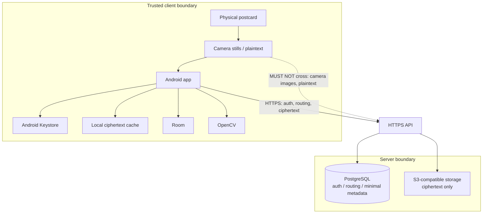
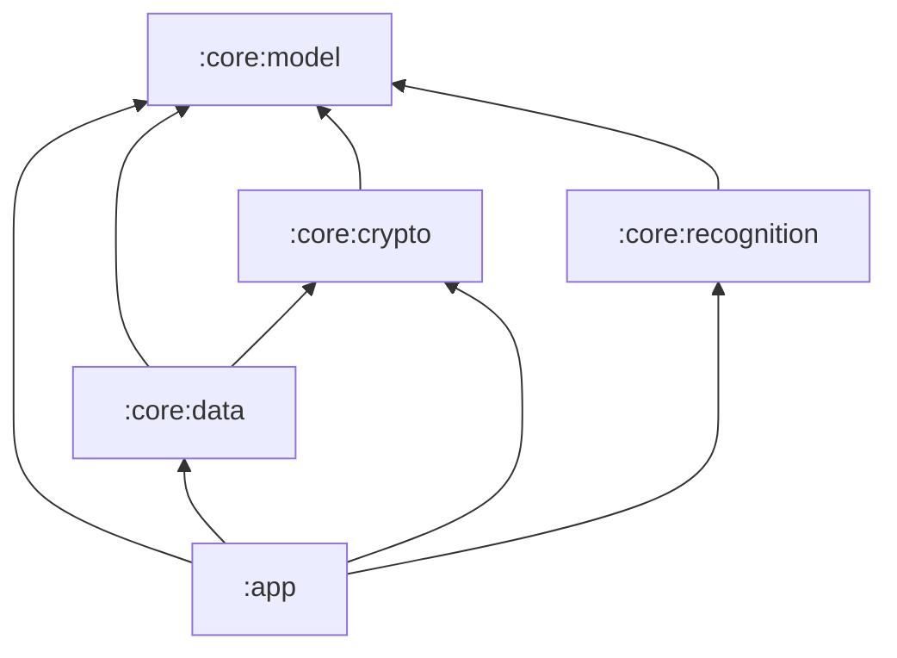

# System context and technology boundaries

This document is normative for system context, trust boundaries, the MVP technology stack, and Android module boundaries. It does not define local tables, backend layout, API endpoints, or cryptographic algorithms.

## 1. Architecture goals

- Production-shaped MVP: real mechanisms, few features.
- Computer vision and cryptography run locally on the client.
- The backend is dumb: routing, account metadata, and ciphertext storage only.
- Local backend setup MUST be command-line reproducible.

## 2. System context

Camera images and plaintext MUST NOT cross the trusted client boundary. Encrypted recognition manifests are ciphertext and MAY be stored and routed by the server.

## 3. Responsibilities

### Android (trusted client)

**Does:**

- Authenticate, hold identity material in Android Keystore, and resolve recipients.
- Capture stills of postcard front and back.
- Run local hierarchical recognition.
- Encrypt and sign capsule content and recognition material locally.
- Cache ciphertext and issue in-memory scan grants.
- Present Create and Scan surfaces, fullscreen capsules, and the ambiguity chooser.

**Does not:**

- Rely on the server for CV, decryption, gallery, recommendation, or social functions.
- Send camera frames, raw scans, descriptors, plaintext, capsule keys, or private identity keys to the server.

### Server (dumb backend)

**Does:**

- Authenticate accounts and route between immutable user IDs.
- Store and serve ciphertext, including encrypted recognition manifests.
- Persist only the server-visible metadata listed below.
- Provide S3-compatible object storage for ciphertext.

**Does not:**

- Receive camera frames, raw scans, descriptors, plaintext, capsule keys, or private identity keys.
- Perform computer vision.
- Provide a gallery, recommendation, or social functions.
- Inspect or infer capsule content. Encrypted recognition manifests are ciphertext; the server MAY store and route them, and MUST NOT decrypt or interpret them.

## 4. Chosen MVP stack

Versions are not pinned here.

| Choice | Why now |
| --- | --- |
| Native Kotlin + Jetpack Compose | Native Android is the only client; Compose is the production UI toolkit for that surface. |
| CameraX still capture | Sender and scan flows require still photos of front and back, not video. |
| OpenCV (local) | Hierarchical recognition MUST run on-device and MUST NOT leave the client. |
| Room | Fingerprints, scan-related local state, and cached ciphertext metadata need durable on-device storage. |
| WorkManager | Ciphertext upload MUST be resumable across process death and connectivity loss. |
| Tink | Real client-side E2EE is in MVP scope; Tink is the Android cryptographic library for that work. |
| FastAPI | Thin HTTPS API for a dumb routing/storage backend, reproducible from the command line. |
| PostgreSQL | Auth, routing, and minimal metadata need a relational store. |
| SQLAlchemy / Alembic | Server persistence and schema migrations for that PostgreSQL store. |
| S3 abstraction (local filesystem adapter in development; S3-compatible adapter in production) | Ciphertext MUST live in object storage; local filesystem keeps development reproducible without a cloud account. |
| Docker Compose | Local backend MUST be command-line reproducible as a single stack. |

## 5. Trust boundaries and server-visible metadata

The trusted client boundary contains camera images, plaintext, descriptors, capsule keys, private identity keys, and decrypted recognition material.

The server MAY see only:

- account email
- normalized handle
- immutable user IDs
- public key records and key IDs
- sender/recipient routing
- ciphertext sizes, timestamps, and status

Private content and recognition material MUST be encrypted before they leave the client. The server MUST treat all such blobs as opaque ciphertext.

## 6. Architecture gate

Application code MUST NOT start until `docs/product.md`, architecture, security, protocol, recognition, milestones, and acceptance-criteria documents are mutually consistent.

## 7. Android module boundaries

MVP uses exactly these Gradle modules:

- `:app`
- `:core:model`
- `:core:data`
- `:core:crypto`
- `:core:recognition`

### Responsibilities and dependencies

- **`:core:model`** is a pure Kotlin module of identifiers, value objects, and state. It depends on nothing else in this graph.
- **`:core:crypto`** is an Android library wrapping Tink and Android Keystore. It MAY depend only on `:core:model`.
- **`:core:recognition`** is an Android library wrapping OpenCV. It MAY depend only on `:core:model`. OpenCV types MUST stay inside this module.
- **`:core:data`** owns Room, network and storage adapters, repositories, and WorkManager. It MAY depend on `:core:model` and on narrow crypto interfaces from `:core:crypto`. Recognition payloads MUST be treated as opaque blobs; `:core:data` MUST NOT depend on `:core:recognition`.
- **`:app`** owns Compose UI, CameraX integration, navigation, orchestration, and DI. It MAY depend on all core modules.

No core module MAY depend on `:app` or on UI types. Backend DTOs MUST NOT leak into domain models in `:core:model`.

### Feature packages stay in `:app`

Feature code remains packages inside `:app` rather than additional Gradle modules. MVP has few surfaces, one activity, and no second client; extra feature modules would add Gradle graph cost without a shippable boundary. The isolation that matters for this product is already module-split: model, crypto, recognition, and data stay UI-free. Features stay packages so navigation and orchestration remain in one place.

Feature packages:

- `auth`
- `home`
- `create`
- `scan`
- `capsule`

Navigation is one-activity Compose navigation. Capsule presentation is not a generally addressable or deep-link route. Opening a capsule REQUIRES an in-memory, unexpired scan grant produced by a successful scan. Process death MUST invalidate the grant.

CameraX captures stills only. WorkManager syncs ciphertext and metadata only. WorkManager MUST NEVER upload or persist camera images or plaintext.

### Conceptual interfaces

Names only; no code in this document.

- `HandleResolver` — resolve a handle to an immutable user ID and active public key.
- `CapsuleRepository` — load and persist capsule ciphertext/metadata visible to the client.
- `OutboxRepository` — resumable sender upload/finalize state.
- `IdentityKeyManager` — identity key material via Keystore.
- `CapsuleCryptor` — local encrypt/sign and decrypt/verify of capsule content.
- `PostcardRecognizer` — local hierarchical matching of postcard stills.
- `FingerprintStore` — persist recipient/sender fingerprints after successful receipt.
- `ScanGrantManager` — issue and expire in-memory scan grants.
